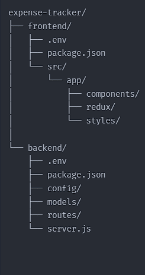

# Expense Tracker app.

A web applicatio for tracking daily expenses. users can enter limitations for categors (eg: Groceries, Transportaion) for each day.
The application is build with Next.js, raw CSS, Redux Toolkit, backend: node.js express.js Database is MongoDB.

## Features

### Expense Management.

- Add expenses in different categories such as Groceris, Transportaion etc.
- Date and time Recording for each expenses.
- user can limit their expenses based on categories.
- Managing user expenses by different userId for each user
- Showing summary of the all expenses and and total expenses for a day.
- User can add expenses multiple time a day.
- User can delete a expense if wanted.

### Sammary

- Daily expanses are categorized by type.
- Interactive tooltips showing more information about each catogories.
- clean and reponsive interface.

### Tech stack

#### Frontend

- Next.js
- Redux Toolkit for state management
- Raw CSS (no external libraries)

#### Backend

- Node.js with express.
- MongoDB for Database.

## API Reference

#### Get limits

```http
  GET /api/limits
```

| Parameter | Type     | Description |
| :-------- | :------- | :---------- |
|           | `string` |             |

#### Post limits (To setup spending limits)

```http
  POST /api/limits
```

| Parameter | Type     | Description                                                                                                      |
| :-------- | :------- | :--------------------------------------------------------------------------------------------------------------- |
|           | `string` | **Required**. here userId is required which is geting from localStorage or gets created in the handler function. |

#### Post expenses

```http
  POST /api/expenses
```

| Parameter | Type     | Description                                                              |
| :-------- | :------- | :----------------------------------------------------------------------- |
|           | `string` | **Required** Here is also userId is requied which stored in the storage. |

#### Delete an expense

```http
  DELETE /api/expenses/:id
```

| Parameter | Type     | Description                            |
| :-------- | :------- | :------------------------------------- |
| id        | `string` | **Required** Delete a expense uisng id |

## Installation

Clone expense tracker with npm and run it locally.

```bash
 mkdir your-folder-name

 git clone https://github.com/MohammadIqbalHossain/expense-tracker.git

```

Run the frontend

```bash
cd your-folder-name

npm run dev

```

Clone backend locally and run it.

```bash
mkdir your-backend-project-name

git clone https://github.com/MohammadIqbalHossain/backend-expense-tracker.git
```

Run the backend

```bash
cd your-backend-project-name

npm run dev

```

### File structure.



## Demo

Click the link see the live site.

https://expense-tracker-beta-kohl.vercel.app/

## Deployment

If you've contributed or made some changes you can deploy it in vercel. install vercel CLI globally in you machine. open you terminal, and run:

```bash
vercel
```

### Necessery links

Frontend github link

https://github.com/MohammadIqbalHossain/expense-tracker

Backend github link

https://github.com/MohammadIqbalHossain/backend-expense-tracker

Thank you!
